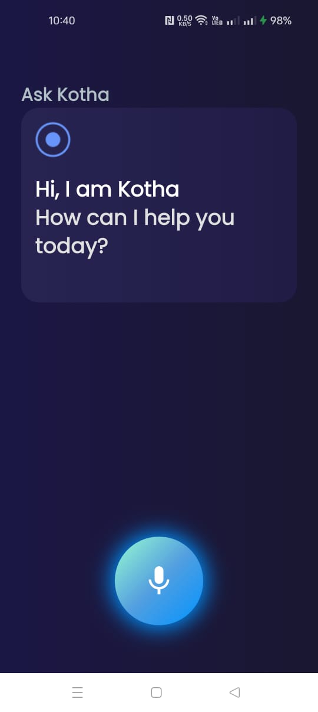
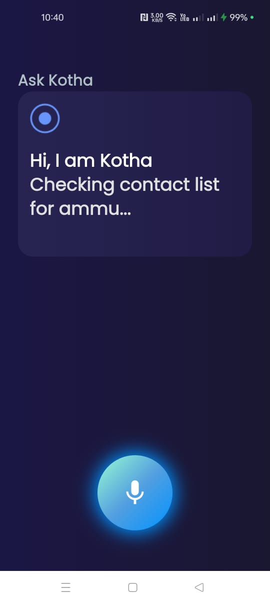

# 🤖 KothaAI – Voice Assistant App (Flutter)

KothaAI is a futuristic, Jarvis-inspired voice assistant app developed using Flutter. It supports voice commands, animated mic effects, and text-to-speech output.

<div align="center">
  
</div>

---

## ✨ Features

- 🎤 Voice input using speech recognition
- 🔊 Text-to-speech response with Flutter TTS
- 🌈 Lottie mic pulse animation (Jarvis-style)
- 🧠 Intelligent voice response area
- 📱 Clean & modern UI with dark theme
- 🌐 Multi-language support ready (Bangla, English)
- 🔌 IoT integration ready (smart light on/off)

---

## 🖼️ Screenshots

| Home Screen | Mic Listening | 
|-------------|----------------|-------------------------|
|  |  |
---
| After Call Command Work |
|-------------------------|
|  |

---

## 🚀 Getting Started

### 1. Clone the repository

```bash
git clone https://github.com/your-username/kothaai.git
cd kothaai
